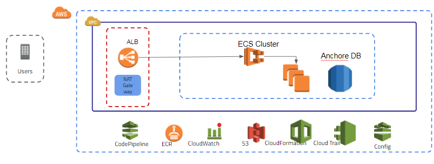
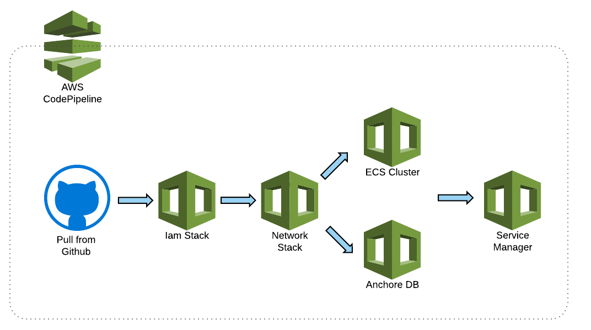

# Overview

AWS DevOps SpringBoard is a readymade automated solution to create an automated pipeline to deploy microservices on ECS.
AWS Devops Springboard consists of following components.

* A VPC, an Application Load Balancer, an ECS cluster

* CI/CD Pipeline to deploy infrastructure

* Pipelines to build, test and deploy microservice applications

This repository contains the templates to create landing-zone resources for devops-springboard. Landing zone includes
* **IAM Roles**
* **Network infrastructure**
    * A highly available architecture that spans two Availability Zones.
    * A VPC configured with public and private subnets according to AWS best practices, to provide you with your own virtual network on AWS.
    * An internet gateway to allow access to the internet.
    * In the public subnets, managed NAT gateways (in each Availability Zones) to allow outbound internet access for resources in the private subnets.
* **Cluster Resources**
    * A Public facing [application load balancer](https://docs.aws.amazon.com/elasticloadbalancing/latest/application/introduction.html)
    * [An ECS Cluster](https://docs.aws.amazon.com/AmazonECS/latest/developerguide/ECS_clusters.html)
    * An [autoscaling group](https://docs.aws.amazon.com/autoscaling/ec2/userguide/AutoScalingGroup.html) to run containers if [Fargate](https://docs.aws.amazon.com/AmazonECS/latest/developerguide/AWS_Fargate.html) is not available
    * An RDS instance for [anchore-engine](https://anchore.com/) as a persistent store.
* **Service Manager Pipeline**: 
   This is a CodePipeline which detects changes made to service deployment pipeline in [devops-springboard-pipelines](https://github.com/Flux7Labs/devops-springboard-pipelines) repository and creates or updates Service Catalog Products.

## Landing Zone Architecture
Following diagram describes landing zone architecture

## Getting started

* Create a GitHub access token. Follow the instructions provided in https://help.github.com/articles/creating-a-personal-access-token-for-the-command-line/
* Create a keypair named `devops-springboard` if Fargate is not available in the region you want to deploy.

* Deploy the landing zone pipeline stack using the template [lz-pipeline.yml](cf-templates/landing-zone-pipeline/lz-pipeline.yml)
Following diagram describes the infrastructure deployment pipeline

